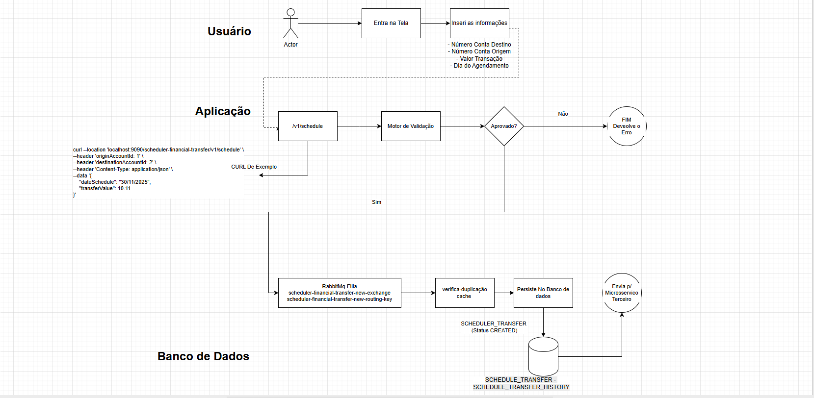
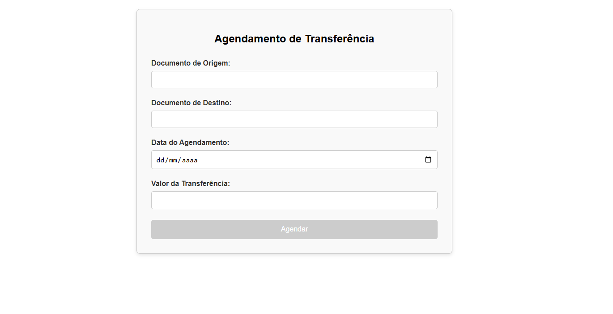
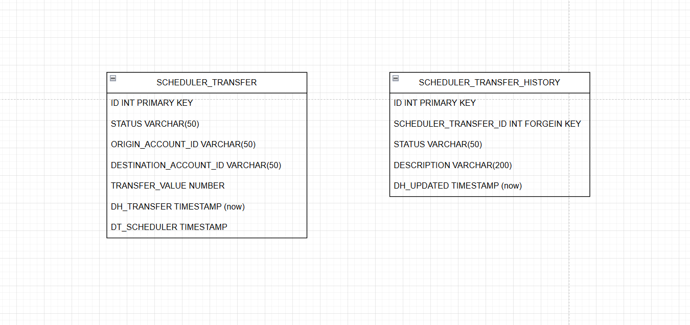

# Entrevista de Código - Agendamento de Transferencia Financeira

Explicando as decisões tomadas para a entrevista técnica de código - Vitor Cosso

- `Fluxograma GERAL UML & Técnico`


- `Tela de Agendamento de Transferencia`


- `Relacao de tabelas`


## Endpoint /POST -> /v1/schedule

```
curl --location 'localhost:9090/scheduler-financial-transfer/v1/schedule' \
--header 'origin-account-id: 1' \
--header 'destination-account-id: 2' \
--header 'x-permission-x: INTERNAL_SCHEDULER' \
--header 'login: cosso' \
--header 'Content-Type: application/json' \
--header 'Cookie: JSESSIONID=EE6EE1895C442A9185913A4113A5BC27' \
--data '{
    "dateSchedule": "10/10/2020",
    "transferValue": 10.11
}'

```

- `Origin e Destination Account ID nos headers` -> Essa decisão foi tomada pela segurança de tramitar dados sensíveis pelo body.

- `Não salvar diretamente no fluxo do POST` -> O Fluxo do POST de agendar uma nova trasnferencia não tem a responsabilidade de salvar e enviar para os outros fluxo. Ele somente tem a responsabilidade de verficar se é valido ou não e a persistencia e outros tipos de comunicações, tanto para segregar e melhorar o desempenho da API, ficam para as filas.


- `Arquitetura MVC` -> Devido a complexidade do projeto, a arquitetura MVC para esse padrão está muito bem implementada, não havendo uma forte necessidade de segregação de fases como na Arquitetura Hexagonal/Clean Architecture

Porém, alguns padrões foram seguidos para manter um bom código, seguindo o Clean Code (Uncle Bob) e os princípios do SOLID e DRY

- `Simulação de Regras de Negócio` -> As regras de negócio foram implementadas de forma ficticia:
    - Valor da Transacao ser maior que 0.0 reais
    - Data de agendamento não pode ser no passado
    - Destination e Account ID não estar bloquada por serviço externo (simulando retorno com um valor mockado 'true')
  

- `Arquitetura voltada a Microsservico` -> Fiz esse projeto pensando em uma arquitetura voltada a microsservico e fluxos assincronos. Por isso não há uma enorme complexidade para o serviço entender e ser muito robusto à outros fluxos e arquiteturas

- `Historico de Transacao/Agendamento` -> Para melhor análise do agendamento da transcao, toda a alteracao relacionado a ela, é persistida no banco de dados e uma nova linha na tabela de historico para indicar o que aconteceu com um status.
Isso serve para debug. 


- `OBSERVAÇÕES` -> Não consegui realizar uma requisição do front p/ o back end, mesmo desabilitando o CORS no Spring Security.